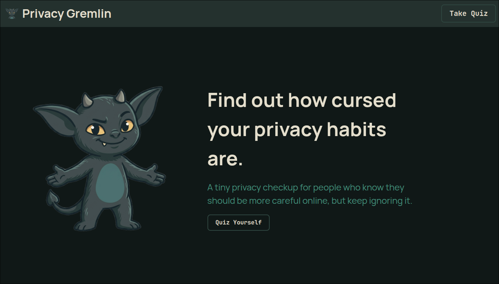
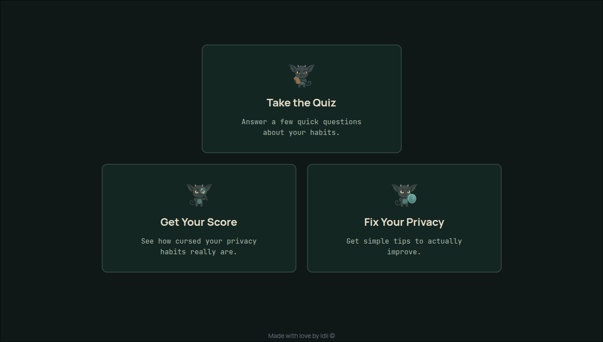
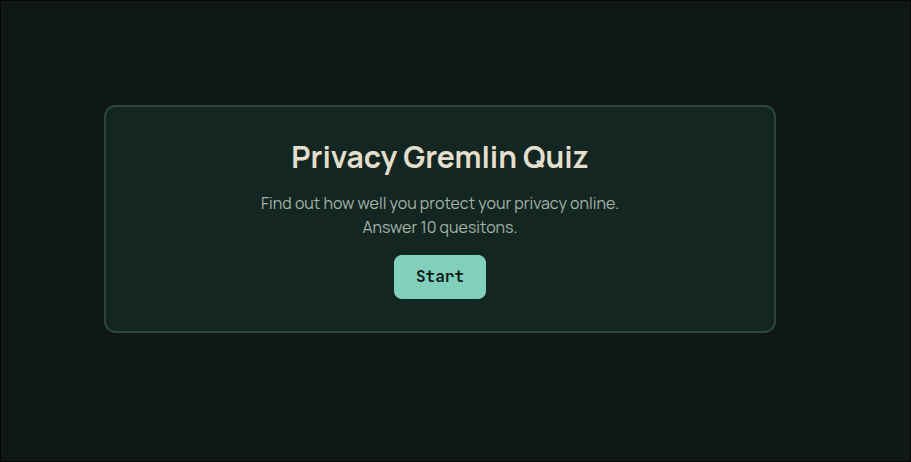
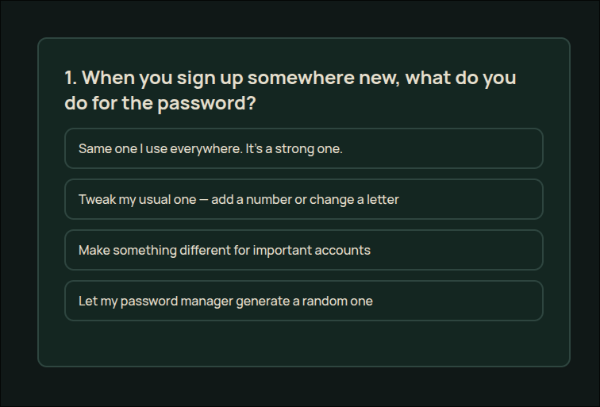
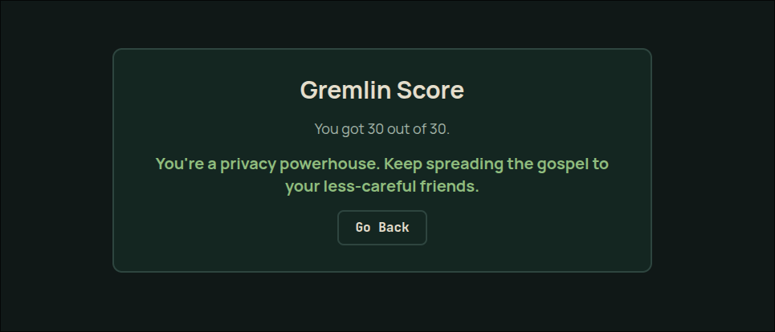

# PrivacyGremlin

A small interactive privacy habit checker that quizzes users about their online habits, gives them a score, and suggests simple ways to improve their digital privacy.

## Demo

Live demo: https://privacy-gremlin.netlify.app/

## What it does
PrivacyGremlin asks the user a set of questions about common privacy and security habits, such as passwords, two-factor authentication, app permissions, browser habits, and suspicious links.

Based on the answers, it calculates a score and shows feedback that helps the user understand whether their habits are risky, okay, or strong.

## Why I built it
- I built this because privacy advice is often too boring or too technical.
-  I wanted to make a small quiz that feels more friendly and interactive.
- This project is one of the actual interactive web app instead of only making static pages.

## Features
- Start screen for the quiz
- Multiple-choice privacy questions
- Score calculation based on selected answers
- Final result screen
- Responsive layout
- Gremlin-themed visual style

## Tech stack
- HTML
- Tailwind CSS
- Vanilla JavaScript

## How it works
- The quiz questions are stored as `questions.json`.
- When the user selects an answer, the app adds the points to the total score and moves through the quiz.

At the end, the app compares the user’s score with the maximum possible score and displays a result message.

## What I learned
While building this project, I practiced:

- Structuring a small frontend project
- Manipulating the DOM with JavaScript
- Managing quiz screen state
- Writing cleaner HTML and CSS

## Problems I faced
The hardest parts were:

- Designing the gremlin mascot/assets
- Connecting the quiz data to the UI
- Handling the result screen cleanly

I had to simplify the project and focus on making one complete interactive thing instead of trying to make it perfect.

## Future improvements
Some things I may add later:

- More quiz questions
- Category-based scores
- Better result explanations
- Progress Tracker
- Personalized Advices
- Animations
- More gremlin reactions based on the user’s result
- Improved accessibility

## Running locally

1. Clone the repository

`git clone https://www.github.com/idli69/privacy-gremlin.git`

2. Install dependencies
`npm install`
3. Start the development server
`npm dev`
4. Open the local URL in your browser

## Screenshots

- Landing page

- Quiz screen

- Result screen

